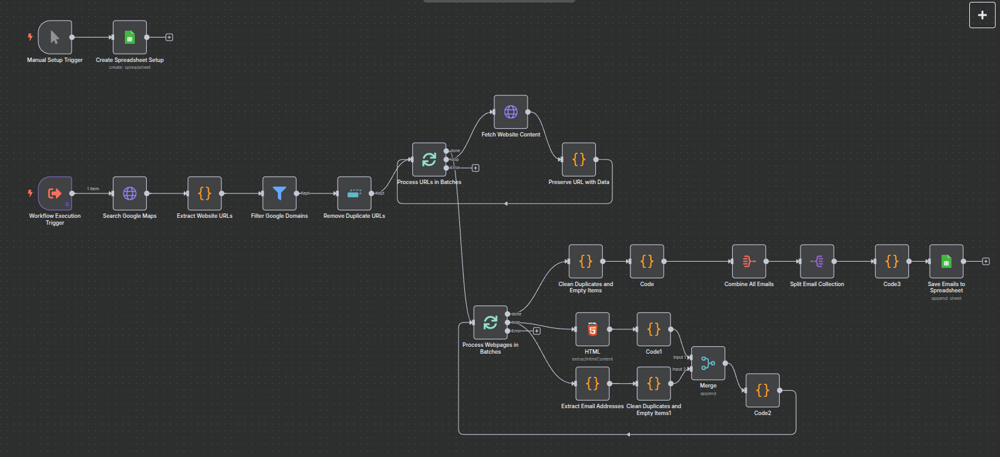
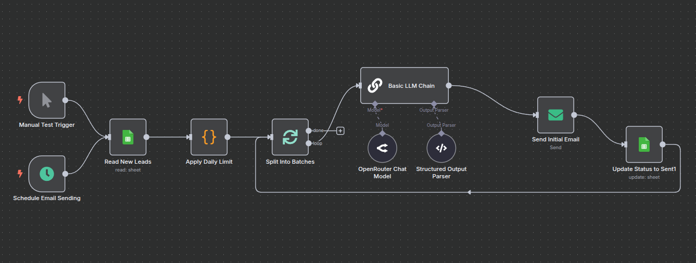
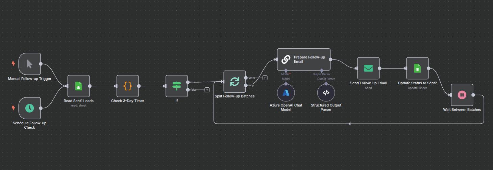
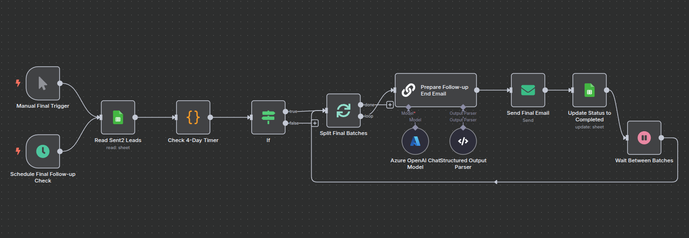
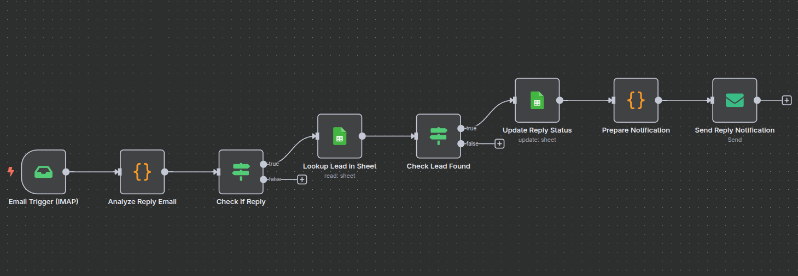
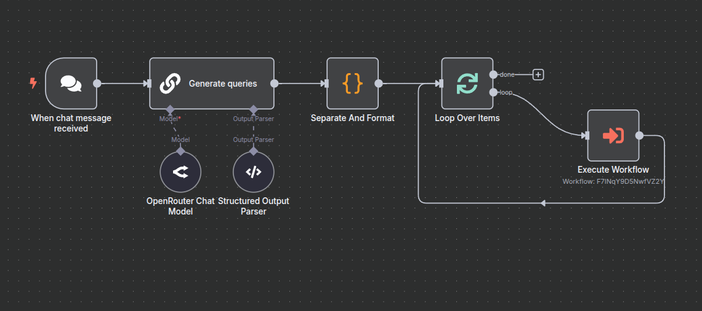

# Coldmail Automation (Google Maps → Emails → 3‑Step Outreach + Reply Monitor)

> End‑to‑end n8n system that: generates Google Maps queries, scrapes business websites, extracts contact emails, stores leads in Google Sheets, sends a 3‑email cold outreach sequence (initial + 2 follow‑ups), and monitors IMAP for replies to mark leads as replied and notify the owner.

## In short, the system

- Finds small businesses via Google Maps queries (real estate/finance by default).
- Visits each website, extracts readable text (`siteContent`) and detects contact emails.
- Saves leads in Google Sheets with full context (email(s), domain, status, `lastSent`, `campaign`, `dateAdded`, `siteContent`).
- Uses AI to personalize outreach: the LLM selects the best recipient from found emails and writes a tailored message referencing the website’s content and likely pain points.
- Sends a 3‑step sequence with safe pacing (batches, delays, daily limits) and automatic status transitions (`new → sent1 → sent2 → completed`).
- Watches the inbox via IMAP; replies automatically set status to `replied` and trigger a notification email to the owner.
- Includes deduplication, error‑tolerant loops and basic rate‑limit hygiene to keep runs stable.

---

## 1. Technical Overview

### 1.1 Leads scraping from Google Maps → websites

| Step | Key nodes | Purpose |
| ---- | --------- | ------- |
| Initialize (one‑time) | `Manual Setup Trigger` → `Create Spreadsheet Setup` | Creates Google Spreadsheet with the sheet “emails and links” |
| Trigger per query | `Workflow Execution Trigger` | Starts scraping for a single `query` (e.g. `denver+real+estate+agency`) |
| Google Maps HTML | `Search Google Maps` | GET `https://www.google.com/maps/search/{{ $json.query }}` to fetch listings HTML |
| Extract websites | `Extract Website URLs` → `Filter Google Domains` → `Remove Duplicate URLs` | Regex‑based extraction of external domains from the page; removes Google/*static domains and duplicates |
| Crawl sites (loop) | `Process URLs in Batches` → `Fetch Website Content` → `Preserve URL with Data` | Visits each website, keeps URL context for later parsing |
| Email extraction | `Process Webpages in Batches` → `HTML` → `Code1` → `Extract Email Addresses` | Extracts plain text, cleans artifacts, finds emails via regex, sets campaign fields |
| Clean & roll‑up | `Clean Duplicates…` → `Code` → `Combine All Emails` → `Split Email Collection` | Deduplicates and consolidates to one record per site (emails joined by comma) |
| Persist | `Code3` → `Save Emails to Spreadsheet` | Escapes content and appends rows to Google Sheet |

Notes:
- The sheet columns are: `email`, `site`, `status`, `lastSent`, `campaign`, `dateAdded`, `siteContent`.
- Newly scraped records default to `status = new`, `campaign = mailscraper_auto`.

### 1.2 Outreach sequence (initial + follow‑ups)

#### Mail 1 — Initial cold email

| Step | Key nodes | Purpose |
| ---- | --------- | ------- |
| Schedule/Test | `Schedule Email Sending` / `Manual Test Trigger` | Hourly schedule or manual run |
| Fetch leads | `Read New Leads` | Reads rows with `status = new` |
| Safety limit | `Apply Daily Limit` | Hard limit per day (adjustable) |
| Batching | `Split Into Batches` | Controls SMTP warm‑up and pacing |
| Personalize | `Basic LLM Chain` + `OpenRouter Chat Model` + `Structured Output Parser` | Picks best email from candidates and drafts message using site content |
| Send & update | `Send Initial Email` → `Update Status to Sent1` | Sends via SMTP, marks row as `sent1`, sets `lastSent` |

#### Mail 2 — Follow‑up after 3 days

| Step | Key nodes | Purpose |
| ---- | --------- | ------- |
| Schedule/Test | `Schedule Follow‑up Check` / `Manual Follow‑up Trigger` | Every 6 hours or manual run |
| Select cohort | `Read Sent1 Leads` | Reads rows with `status = sent1` |
| Timing check | `Check 3‑Day Timer` → `If` | Only continue if `now - lastSent ≥ 3 days` |
| Batching | `Split Follow‑up Batches` → `Wait Between Batches` | Paces sending between mini‑batches |
| Personalize | `Prepare Follow‑up Email` + `Azure OpenAI Chat Model` + `Structured Output Parser` | JSON‑structured subject/body |
| Send & update | `Send Follow‑up Email` → `Update Status to Sent2` | Marks row as `sent2` |

#### Mail 3 — Final follow‑up after 4 days

| Step | Key nodes | Purpose |
| ---- | --------- | ------- |
| Schedule/Test | `Schedule Final Follow‑up Check` / `Manual Final Trigger` | Every 8 hours or manual run |
| Select cohort | `Read Sent2 Leads` | Reads rows with `status = sent2` |
| Timing check | `Check 4‑Day Timer` → `If` | Only continue if `now - lastSent ≥ 4 days` |
| Batching | `Split Final Batches` → `Wait Between Batches` | Paces sending between mini‑batches |
| Personalize | `Prepare Follow‑up End Email` + `Azure OpenAI Chat Model` + `Structured Output Parser` | JSON‑structured subject/body |
| Send & update | `Send Final Email` → `Update Status to Completed` | Marks row as `completed` |

### 1.3 Reply monitoring (IMAP)

| Step | Key nodes | Purpose |
| ---- | --------- | ------- |
| Inbox trigger | `Email Trigger (IMAP)` | Listens for new emails on the outreach inbox |
| Heuristics | `Analyze Reply Email` | Detects replies via headers (`In‑Reply‑To`, `References`), subject `Re:`, excludes auto‑mails |
| Find lead | `Lookup Lead in Sheet` → `Check Lead Found` | Locates corresponding row in the sheet |
| Update & notify | `Update Reply Status` → `Prepare Notification` → `Send Reply Notification` | Sets `status = replied`, emails owner with details |

### 1.4 Query generation (LLM → scraper fan‑out)

| Step | Key nodes | Purpose |
| ---- | --------- | ------- |
| Chat entry | `When chat message received` | Lightweight trigger for ad‑hoc generation |
| Generate | `Generate queries` + `OpenRouter Chat Model` + `Structured Output Parser` | Produces JSON array of `{ query: "city+business_type" }` |
| Normalize | `Separate And Format` | Replaces whitespace with `+` |
| Fan‑out | `Loop Over Items` → `Execute Workflow (mailscraper v2)` | Runs the scraper once per query |

---

## 2. Fields to customise before running

| Configuration Field | Nodes | Value to insert | Notes |
| -------------------- | ----- | --------------- | ----- |
| Google Sheets OAuth2 | All Google Sheets nodes | Your credential | Needed for create/read/append/update |
| Spreadsheet ID | All Google Sheets nodes | Your Sheet ID (default was a sample) | Replace the demo ID with your own |
| Sheet Name | All Google Sheets nodes | `emails and links` | Must exist (created by setup node) |
| SMTP Credentials | All Email Send nodes | Your SMTP account | From address (e.g. `kevin@yourdomain.com`) |
| IMAP Credentials | `Email Trigger (IMAP)` | Your IMAP account | Inbox that receives replies |
| OpenRouter API | `OpenRouter Chat Model` | Your OpenRouter key | Used in initial email and query generation |
| Azure OpenAI API | `Azure OpenAI Chat Model` | Your Azure credentials | Used in follow‑up 2 and 3 |
| Daily send limit | `Apply Daily Limit` | Integer (e.g. 30/50/100) | Edit in node code (was `1` for safe tests) |
| Batch sizes/delays | Split/Wait nodes | Integers | Tune to your SMTP warm‑up and deliverability |

---

## 3. Import & Configuration

1. Import JSON workflows in n8n (Workflows → Import):
   - `coldmail automation/google_map_query.json`
   - `coldmail automation/mailscraper.json`
   - `coldmail automation/send_mail.json`
   - `coldmail automation/send_mail2.json`
   - `coldmail automation/send_mail3.json`
   - `coldmail automation/replies_mails.json`
2. Create credentials:
   - Google Sheets OAuth2, SMTP, IMAP
   - OpenRouter (for initial email + queries) and/or Azure OpenAI (follow‑ups)
3. Run one‑time setup:
   - Open `mailscraper v2` and run `Create Spreadsheet Setup` to create the spreadsheet and sheet
4. Test scraping:
   - Trigger `google map query v2` or manually run `mailscraper v2` with a test `query`
   - Verify new rows appear in the sheet (status `new`)
5. Activate outreach:
   - Enable `send mail v2`, `send mail2 v2`, `send mail3 v2` once copy/limits are configured
6. Enable reply monitor:
   - Activate `replies mails` after IMAP credential is working
