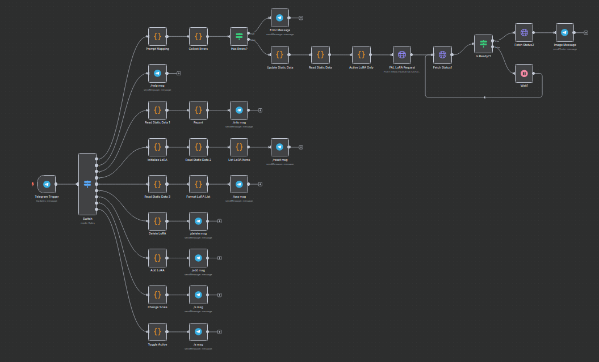

# FAL.ai Telegram Image Generator (LoRA-enabled)

> Telegram bot that generates images via FAL.ai (FLUX with LoRA support), with in-chat management of active LoRAs and generation parameters. Messages are routed through n8n, validated, stored in workflow global state, sent to FAL’s async queue, polled for completion, and the final image is posted back to Telegram.

---

## 1. Technical Overview

### Section 1: Routing and Help
| Step | Key nodes | Purpose |
| ---- | --------- | ------- |
| Message intake | `Telegram Trigger` | Receives messages from allowed Telegram user IDs |
| Routing | `Switch` | Routes between free-text prompts and slash commands |
| Help | `/help msg` | Sends usage guide and available commands |

### Section 2: Prompt parsing and validation
| Step | Key nodes | Purpose |
| ---- | --------- | ------- |
| Parse flags | `Prompt Mapping` | Extracts `-i` (image size), `-s` (steps), `-g` (guidance) and trims prompt |
| Collect errors | `Collect Errors`, `Has Errors?`, `Error Message` | Aggregates validation errors and replies if any |
| Update config | `Update Static Data`, `Read Static Data` | Stores/reads global generation settings (image size, steps, guidance) |

### Section 3: LoRA management (commands)
| Command | Key nodes | Purpose |
| ------- | --------- | ------- |
| `/reset` | `Initialize LoRA` → `Read Static Data 2` → `List LoRA Items` → `/reset msg` | Resets preset LoRA list and prints a summary |
| `/lora` | `Read Static Data 3` → `Format LoRA List` → `/lora msg` | Lists all LoRAs with active state, scale and path |
| `/add <name> <url>` | `Add LoRA` → `/add msg` | Adds a new LoRA (default scale 1.0, active=true) |
| `/delete <name>` | `Delete LoRA` → `/delete msg` | Removes a LoRA by name |
| `/s <name> <scale>` | `Change Scale` → `/s msg` | Changes the scale for a LoRA |
| `/a <name>` | `Toggle Active` → `/a msg` | Toggles a LoRA’s active/inactive state |
| `/info` | `Read Static Data 1` → `Report` → `/info msg` | Prints current generation settings and active LoRAs |

### Section 4: Generation request and delivery
| Step | Key nodes | Purpose |
| ---- | --------- | ------- |
| Select LoRAs | `Read Static Data` → `Active LoRA Only` | Filters only active LoRAs (path, scale) for the request |
| Send request | `FAL LoRA Request` | POST to `https://queue.fal.run/fal-ai/flux-lora` (async) |
| Poll status | `Fetch Status1` → `Is Ready?1` → `Wait1` loop | Polls `.../requests/{id}/status` until `COMPLETED` |
| Fetch result | `Fetch Status2` | GET `.../requests/{id}` with image URLs |
| Deliver | `Image Message` | Sends `images[0].url` back to the Telegram chat |

---

## 2. Fields to customise before running

| Configuration Field | Nodes | Value to insert | Notes |
| -------------------- | ----- | --------------- | ----- |
| Telegram Credentials | `Telegram Trigger` and all Telegram send nodes | Your Telegram bot token (credential: “Telegram account”) | Ensure webhook is properly set in your n8n setup |
| Allowed Telegram Users | `Telegram Trigger` | Comma-separated IDs (e.g. `1951630053,329703279`) | Restricts who can use the bot |
| FAL Header Auth | `FAL LoRA Request`, `Fetch Status1`, `Fetch Status2` (credential: “fal.ai”) | Your API header(s) | Typically an Authorization header per FAL.ai setup |
| Default Generation Settings | `Update Static Data` | `image_size` (`square_hd`), `num_inference_steps` (10), `guidance_scale` (7.5) | Adjust defaults to taste |
| Safety Checker | `FAL LoRA Request` body | `enable_safety_checker: false` | Consider enabling depending on your policy |

---

## 3. Import & Configuration

1. Import the workflow JSON:
   - n8n → Workflows → Import → select `fal bot/fal_bot_ai_copy.json`.
2. Create credentials:
   - Telegram: create “Telegram account” with your bot token and wire to all Telegram nodes.
   - FAL.ai: create HTTP Header Auth credential named “fal.ai” with required headers.
3. Configure allowed Telegram user IDs in the `Telegram Trigger` node.
4. Initialise LoRAs by sending `/reset` in the chat (loads default three LoRAs).
5. Test commands:
   - `/help`, `/info`, `/lora`, `/add <name> <url>`, `/delete <name>`, `/s <name> <scale>`, `/a <name>`.
6. Generate an image with a prompt and flags, e.g.:
   - `a cinematic photo of a snow leopard -i square_hd -s 40 -g 7`

---

## 4. Commands & Flags Reference

- Commands
  - `/help` – usage guide
  - `/info` – current settings and active LoRAs
  - `/lora` – list LoRAs with status and URLs
  - `/add <name> <url>` – add LoRA
  - `/delete <name>` – delete LoRA
  - `/s <name> <scale>` – set LoRA scale (e.g. 0.1–10)
  - `/a <name>` – toggle LoRA active state
  - `/reset` – restore default LoRAs

- Prompt flags (optional)
  - `-i` image size: `square_hd`, `square`, `portrait_4_3`, `portrait_16_9`, `landscape_4_3`, `landscape_16_9`
  - `-s` steps: `1–50`
  - `-g` guidance: `0.1–10`

---

## 5. Notes & Limitations

- Global state: settings and LoRAs are stored in workflow global `staticData` and are shared among all allowed users. Consider per-chat scoping if needed.
- Polling: there is no hard timeout/attempt limit in the status polling loop; consider adding one for reliability.
- Result handling: only the first image (`images[0]`) is sent; extend if you need multiple.
- Safety: `enable_safety_checker` is set to `false` in the request body. Review before production use.

