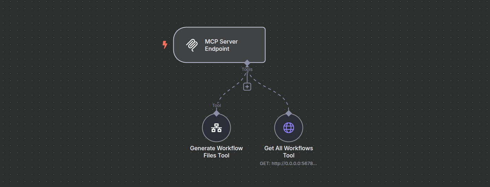
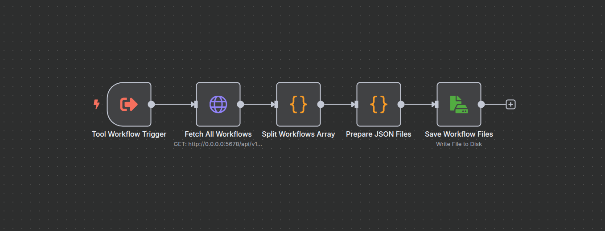
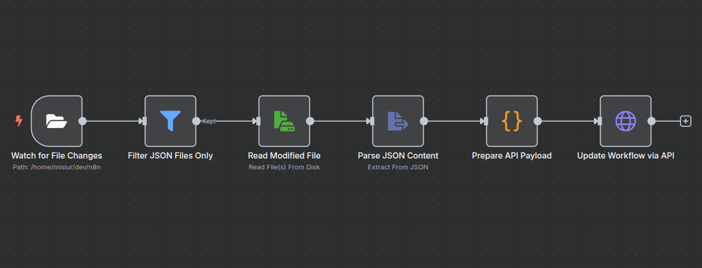

# n8n Workflow Automation System for AI Agents

> Complete n8n workflow automation system with three interconnected workflows that provide automatic synchronization, file management, and MCP (Model Context Protocol) integration for AI agents. Enables seamless collaboration between AI agents (like one in Cursor Ai) and local n8n workflows.
---

## 1. Technical Overview

### Workflow 1: MCP Server & AI Agent Integration

| Step | Key nodes | Purpose |
| ---- | --------- | ------- |
| **MCP Protocol** | `MCP Server Endpoint` | Exposes Model Context Protocol endpoint for AI agents |
| **Workflow Retrieval** | `Get All Workflows Tool` | HTTP tool that fetches all workflows from n8n API |
| **File Generation** | `Generate Workflow Files Tool` | Workflow tool that triggers export of all workflows to JSON files |

### Workflow 2: Workflow Export & File Management

| Step | Key nodes | Purpose |
| ---- | --------- | ------- |
| **Tool Trigger** | `Tool Workflow Trigger` | Triggered by MCP server when generate files tool is called |
| **Data Retrieval** | `Fetch All Workflows` | Retrieves all workflows from n8n API for export |
| **Array Processing** | `Split Workflows Array` | Splits workflows array into individual items for processing |
| **File Preparation** | `Prepare JSON Files` | Converts each workflow into JSON file format with proper naming |
| **File Output** | `Save Workflow Files` | Writes JSON files to local filesystem in n8n directory |

### Workflow 3: Auto-Sync & Real-time Updates

| Step | Key nodes | Purpose |
| ---- | --------- | ------- |
| **File Monitoring** | `Watch for File Changes` | Monitors n8n directory for file changes using polling |
| **Smart Filtering** | `Filter JSON Files Only` | Only processes JSON files, ignoring other file types |
| **Content Reading** | `Read Modified File` | Reads content of modified file from disk |
| **Data Parsing** | `Parse JSON Content` | Extracts and validates JSON data from file |
| **API Formatting** | `Prepare API Payload` | Transforms workflow data for n8n API format |
| **Workflow Update** | `Update Workflow via API` | Sends PUT request to update workflow in n8n |

---

## 2. Configuration Requirements

| Configuration Field | Nodes | Value to configure | Notes |
| -------------------- | ----- | --------------- | ----- |
| **n8n API Credentials** | `Get All Workflows Tool`, `Fetch All Workflows`, `Update Workflow via API` | Your n8n API key | Required for all API operations |
| **Watch Directory** | `Watch for File Changes` | `/path/to/your/n8n/directory` | Directory path to monitor for workflow files |
| **n8n API Endpoint** | `Get All Workflows Tool`, `Fetch All Workflows`, `Update Workflow via API` | `http://YOUR_N8N_HOST:PORT/api/v1` | Your n8n instance API URL |
| **File Output Path** | `Save Workflow Files` | `/path/to/your/n8n/directory/{{ $binary.file.fileName }}` | Where to save exported JSON files |
| **MCP Webhook Path** | `MCP Server Endpoint` | Auto-generated webhook ID | Used by AI agents to connect via MCP protocol |
| **Workflow Reference** | `Generate Workflow Files Tool` | Reference to export workflow | ID of the export workflow to trigger |

---

## 3. Setup Instructions

1. **Import Workflows**  
   - n8n → **Workflows > Import** → select all three JSON files:
     - `n8n_mcp_server.json`
     - `workflows_to_files.json` 
     - `updating_workflows.json`

2. **Configure Credentials**:
   - **n8n API Key**: Create "n8n account" credential with your API key
   - Enable API access in n8n settings

3. **Configure File Paths**:
   - Ensure target directory exists and is writable
   - Update paths to match your directory structure

4. **Activate Workflows**:
   - ✅ Activate `n8n_mcp_server.json`
   - ✅ Activate `updating_workflows.json`
   - 🔄 Keep `workflows_to_files.json` inactive (triggered on-demand)

5. **Connect AI Agent**:
   - Configure MCP-compatible agent
   - Use webhook URL from MCP Server Endpoint node

---

## 4. Features Demonstrated

- **MCP Protocol Integration** - Model Context Protocol for AI agent communication
- **Real-time File Monitoring** - Automatic detection of workflow file changes
- **API Management** - Full n8n API integration for workflow operations
- **Dynamic File Processing** - JSON parsing and validation
- **Workflow Automation** - Multi-workflow orchestration system
- **Error Handling** - Robust file filtering and validation
- **Sync Mechanisms** - Bidirectional synchronization between files and API

This system showcases advanced workflow automation and demonstrates proficiency in:
- n8n workflow development and orchestration
- MCP protocol implementation
- API integration and management
- File system monitoring and processing
- Real-time synchronization systems
- AI agent integration patterns
