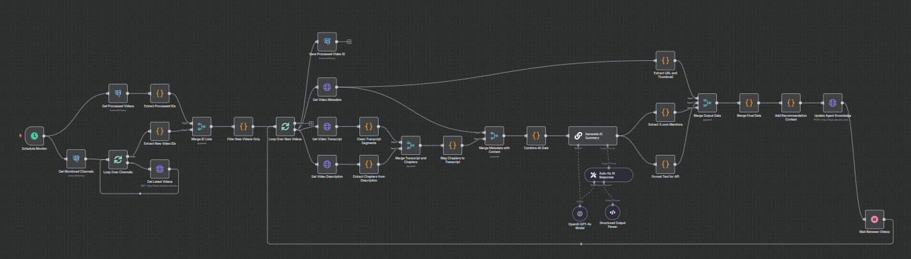
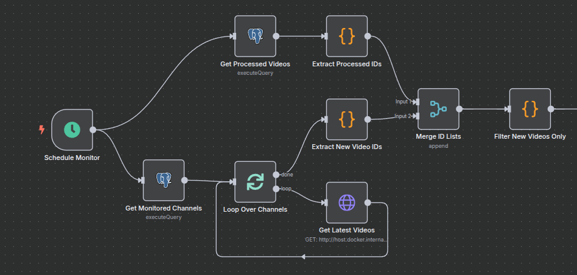
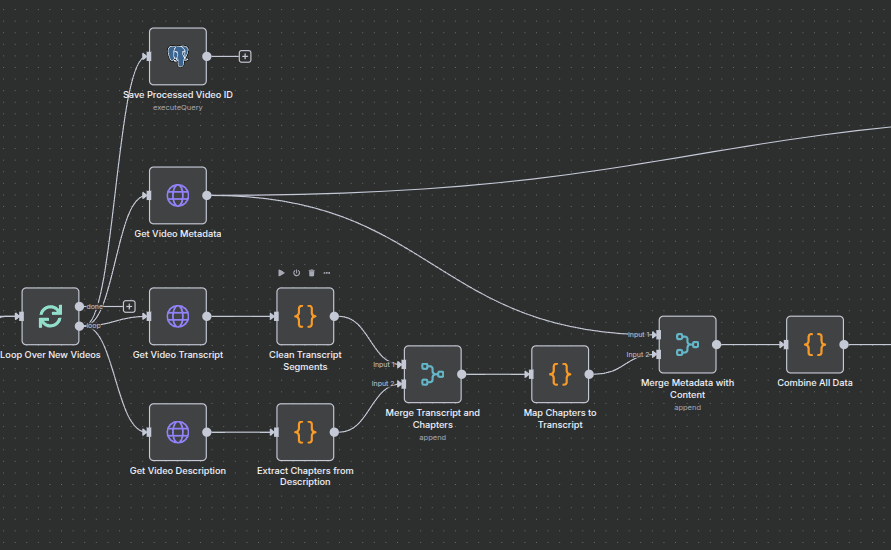
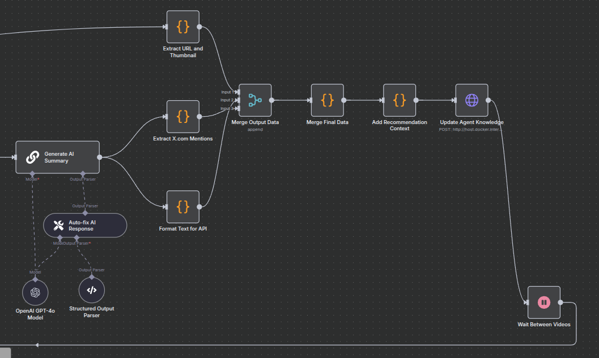

# YouTube Podcasts Processing for ElizaOS based agents


  
> Automatically monitors YouTube podcast channels, extracts and processes content using AI, then feeds intelligent summaries into ElizaOS agent knowledge base. Eliminates manual content curation while providing rich, structured podcast insights for AI-powered recommendations and social media engagement.

---

## 1. Technical Overview

### Section 1: Monitoring & Discovery of new videos


| Step | Key nodes | Purpose |
| ---- | --------- | ------- |
| **Scheduling** | `Schedule Monitor` | Triggers workflow every 30 minutes |
| **Data sources** | `Get Monitored Channels`, `Get Processed Videos` | Fetches list of channels to monitor and already processed videos |
| **Content retrieval** | `Loop Over Channels`, `Get Latest Videos` | Iterates through channels and fetches 3 latest videos from each |
| **Filtering** | `Extract New Video IDs`, `Extract Processed IDs`, `Merge ID Lists`, `Filter New Videos Only` | Identifies only new, unprocessed videos |

### Section 2: Data extraction and processing from videos


| Step | Key nodes | Purpose |
| ---- | --------- | ------- |
| **Video iteration** | `Loop Over New Videos`, `Save Processed Video ID` | Processes each new video individually and marks as processed |
| **Metadata extraction** | `Get Video Metadata`, `Get Video Transcript`, `Get Video Description` | Collects complete data: video info, transcript and description |
| **Data cleaning** | `Clean Transcript Segments`, `Extract Chapters from Description` | Cleans transcript from HTML tags and extracts chapters with timestamps |
| **Content mapping** | `Merge Transcript and Chapters`, `Map Chapters to Transcript` | Intelligently maps transcript segments to chapters by timestamps |
| **Data consolidation** | `Merge Metadata with Content`, `Combine All Data` | Merges all data into single object ready for AI processing |

### Section 3: AI processing and formatting


| Step | Key nodes | Purpose |
| ---- | --------- | ------- |
| **AI analysis** | `Generate AI Summary`, `OpenAI GPT-4o Model`, `Structured Output Parser` | Generates intelligent podcast summary using GPT-4o |
| **Quality correction** | `Auto-fix AI Response` | Automatically fixes AI responses that don't meet structure requirements |
| **Metadata extraction** | `Extract URL and Thumbnail`, `Extract X.com Mentions` | Extracts URL, thumbnail and guest mentions from X.com |
| **Output formatting** | `Format Text for API`, `Merge Output Data`, `Merge Final Data` | Formats data to structure required by agent API |
| **Finalization** | `Add Recommendation Context`, `Update Agent Knowledge` | Adds recommendation context and sends to ElizaOS knowledge base |
| **Flow control** | `Wait Between Videos` | Introduces delay between videos to avoid rate limiting |


---

## 2. Configuration Requirements

| Configuration Field | Nodes | Value to configure | Notes |
| -------------------- | ----- | --------------- | ----- |
| **PostgreSQL Credentials** | `Get Monitored Channels`, `Get Processed Videos`, `Save Processed Video ID` | Your database connection | Store channels in `yt_channels` table, track processed in `watched` table |
| **Schedule Interval** | `Schedule Monitor` | 30 minutes (default) | Adjust monitoring frequency as needed |
| **YouTube Channel API** | `Get Latest Videos` | `http://YOUR_API_HOST:PORT/youtube/channel/videos` | Your YouTube API proxy service |
| **YouTube Video Info** | `Get Video Metadata` | `http://YOUR_API_HOST:PORT/youtube/video/{{ $json.id }}/info` | Video metadata endpoint |
| **YouTube Transcript** | `Get Video Transcript` | `http://YOUR_API_HOST:PORT/youtube/video/{{ $json.id }}/transcript` | Transcript extraction service |
| **YouTube Description** | `Get Video Description` | `http://YOUR_API_HOST:PORT/youtube/video/{{ $json.id }}/description` | Description parsing service |
| **OpenAI Credentials** | `OpenAI GPT-4o Model` | Your OpenAI API key | For AI summarization with GPT-4o |
| **Agent Knowledge API** | `Update Agent Knowledge` | `http://YOUR_AGENT_HOST:PORT/agents/{agent_id}/knowledge` | Replace with your ElizaOS agent endpoint |


---

## 3. Setup Instructions

1. **Import Workflow**  
   - n8n → **Workflows > Import** → select `youtube_podcasts_elizaos.json`
2. **Configure Credentials**
   - PostgreSQL connection for database operations
   - OpenAI API key for GPT-4o access
3. **Setup Database Tables**:
   ```sql
   CREATE TABLE yt_channels (
     id SERIAL PRIMARY KEY,
     url VARCHAR(255) NOT NULL
   );
   
   CREATE TABLE watched (
     id SERIAL PRIMARY KEY,
     video_id VARCHAR(255) UNIQUE NOT NULL,
     processed_at TIMESTAMP DEFAULT CURRENT_TIMESTAMP
   );
   ```
4. **Configure API Endpoints** - Update all URL endpoints to match your environment

---

## 4. Features Demonstrated

- **Automated Content Monitoring** - Scheduled checks for new content
- **Data Processing Pipeline** - Complex data transformation and cleaning
- **AI Integration** - GPT-4o powered content summarization  
- **Database Management** - PostgreSQL integration for state tracking
- **API Integration** - Multiple REST API integrations
- **Error Handling** - Robust error handling and retry mechanisms
- **Rate Limiting** - Built-in delays to respect API limits

This project showcases advanced workflow automation capabilities and demonstrates proficiency in:
- n8n workflow development
- API integration and management
- Database design and operations
- AI/ML integration
- Content processing and analysis


